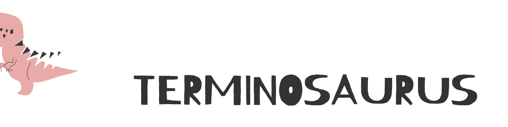

# 

Terminosaurus is a DOM-like UI library for TypeScript that makes it easy to build powerful graphical interfaces for your terminal without having to deal with complex positioning or state updates.

## Features

- Framework-agnostic API
- React renderer
- Advanced layout positioning
- Event handlers
- Text wrapping
- CSS properties
- Fast rendering

## Getting Started

<table><tr>
<th>Framework Agnostic</th>
<th>React Syntax</th>
</tr><tr><td>

```ts
import {
    TermElement,
    TermText,
    run,
} from 'terminosaurus';

run({}, async screen => {
    const text = new TermText();
    text.appendTo(screen.rootNode);

    let counter = 0;

    const increaseCounter = () => {
        counter += 1;
        text.setText(`Counter: ${counter}`);
    };

    text.onClick.addEventListener(() => {
        increaseCounter();
    });

    increaseCounter();
});
```

</td><td>

```tsx
import {
    render,
} from 'terminosaurus/react';

function App() {
    const [counter, setCounter] = useState(0);

    const increaseCounter = () => {
        setCounter(counter + 1);
    };

    return (
        <term:div onClick={increaseCounter}>
            Counter: {counter}
        </term:div>
    );
}

render({}, <App/>);
```

</td></tr></table>
